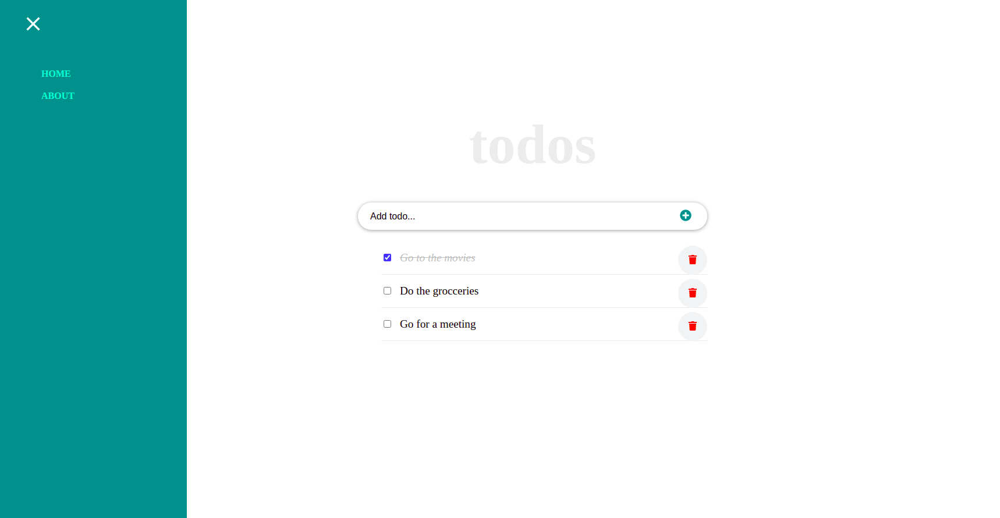

# To-Do-List-App

An application that let you organize your task.

## Built With

- ReactJS
- CSS
- Eslint, Stylelint

## Getting Started

To get a local copy up and running clone the repo and run

`npm install`

### Install

to build a the project into `./build` folder run

`npm run build`

### Usage

to serve the application on `localhost` run

`npm start`

## Authors

👤 **Author1**

- Name: Ajise Toluwase
- GitHub: [@githubhandle](https://github.com/Whoistolu)
- Twitter: [@twitterhandle](https://twitter.com/Littletolu)
- LinkedIn: [LinkedIn](https://www.linkedin.com/in/toluwase-ajise-9b40411b2/)

## 🤝 Contributing

Contributions, issues, and feature requests are welcome!

## Show your support

Give a ⭐️ if you like this project!

## Acknowledgments

- Inspiration
  Original design idea by [Cindy Shin in Behance](https://www.behance.net/adagio07)

## 📝 License

This project is [MIT](./MIT.md) licensed.
